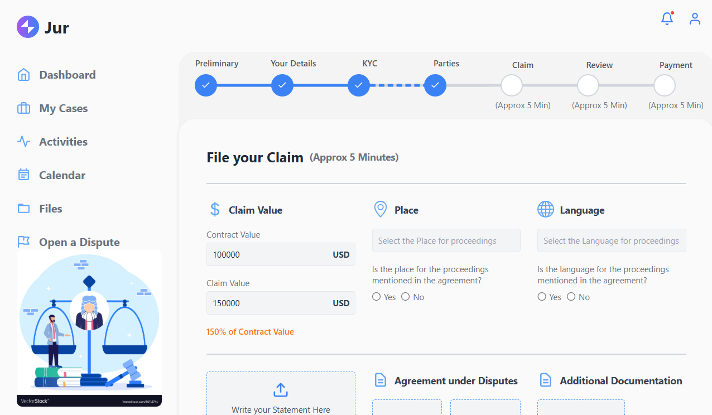
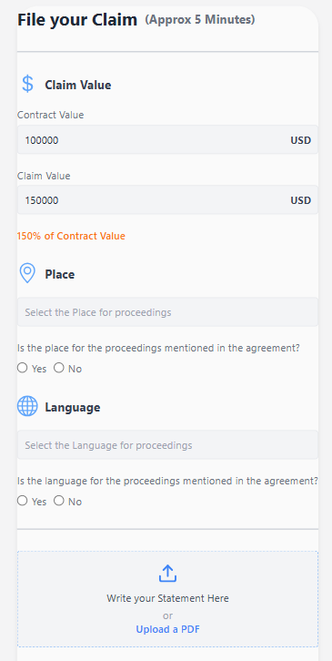

---

# Rise11 Dashboard

## Overview  
This dashboard is designed to provide a responsive, user-friendly interface with modern aesthetics and robust functionality. It is built using **React.js** and **Tailwind CSS**, emphasizing clean design and seamless user interaction.

---

## Features  

### 1. **Responsive Design**
- Adapts seamlessly to various devices, including desktop, tablet, and mobile screens.
- Implemented using **Tailwind CSS** for a utility-first approach to styling.

### 2. **Modern Aesthetic**
- Clean UI featuring gradients, rounded corners, and intuitive layouts.
- Integrated **React Icons** for enhanced visual clarity and interactivity.

### 3. **Dynamic Progress Bar**
- Displays the current step with visual markers and conditional styling for completed, current, and upcoming steps.
- Maintains alignment between circles and connector lines for a cohesive visual flow.

### 4. **File Upload Interaction**
- Interactive file upload sections with meaningful placeholder content.
- Provides feedback by displaying the file name after selection.

### 5. **Cross-Device Consistency**
- Designed primarily for desktop but optimized for tablets and mobile using Tailwind's responsive utilities.

---

## Challenges and Solutions  

### **1. Progress Bar Alignment**
- **Problem:** Misalignment of circles and connecting lines disrupted the visual flow.  
- **Solution:** Used relative positioning (`top-1/2`) and fine-tuned the alignment with `translate-y` utilities. Conditional classes were applied for consistent styling of completed, current, and upcoming steps.

### **2. Interactive File Upload**
- **Problem:** Upload boxes lacked clear interaction cues.  
- **Solution:** Added placeholder text and implemented `useRef` for smooth file upload handling. Users are alerted with the selected file name for confirmation.

### **3. Consistent Spacing**
- **Problem:** Inconsistent spacing between elements like progress bar steps and upload sections.  
- **Solution:** Leveraged Tailwind utilities like `gap`, `space-y`, and `space-x` for consistent spacing across all screen sizes.

---

## Assumptions  

### **1. Styling with Tailwind CSS**
- Tailwind was chosen for rapid prototyping and consistent styling. Utilities like `grid`, `flex`, and `gap` simplified layout adjustments.

### **2. Use of React Icons**
- React Icons were used for visual elements to avoid the overhead of creating custom SVGs.

### **3. File Upload Functionality**
- Assumed basic client-side file upload handling without server-side integration.

### **4. Desktop-First Design**
- Prioritized desktop design while ensuring responsiveness for smaller devices.

---

## Technology Stack  

- **React.js**: Component-based library for building the UI.  
- **Tailwind CSS**: Utility-first CSS framework for fast and responsive styling.  
- **React Icons**: Lightweight library for scalable and customizable icons.

---

## How to Run the Project  

1. Clone the repository:  
   ```bash
   git clone https://github.com/PrabhjotBajwa/Rise11_Dashboard.git
   ```

2. Navigate to the project directory:  
   ```bash
   cd Rise11_Dashboard
   ```

3. Install dependencies:  
   ```bash
   npm install
   ```

4. Start the development server:  
   ```bash
   npm start
   ```

5. Open your browser and go to [http://localhost:3000](http://localhost:3000).

---

## Screenshots  

### **Desktop View**  


### **Tablet View**  


### **Mobile View**  


---

